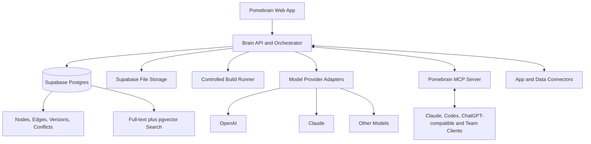

# Pomebrain Product Plan

## 1. Product vision

Pomebrain is a living app-building brain.

The pomegranate is both the visual metaphor and the system model:

- **Seeds** are individual knowledge nodes: agents, skills, tools, decisions, evidence, projects, tests, failures, and lessons.
- **Fibres** are typed relationships between seeds: uses, depends on, validates, contradicts, supersedes, learned from, and belongs to.
- **Pods** group seeds by project, team, domain, or security boundary.
- **The skin** is governance: identity, permissions, provenance, versioning, validation, conflict resolution, and audit history.

Pomebrain is not merely a document store or a chat history. It is the shared, governed source of truth that people and AI systems use to design and build applications.

## 2. Core promise

When a team asks Pomebrain to create an app, it should be able to:

1. Understand the app goal and constraints.
2. Find the most relevant approved agents, skills, tools, decisions, and prior lessons.
3. Assemble an execution team and propose a plan.
4. Build in a controlled workspace with human approval gates.
5. Run tests and evaluations.
6. Store the outcome, failures, and new learning back into the graph.
7. Detect conflicts with existing knowledge without silently deleting history.

## 3. Product principles

1. **One governed brain, many AI models.** Claude, OpenAI, and future models are interchangeable reasoning engines around the same source of truth.
2. **Evidence before freshness.** Newer information does not automatically win; the latest approved and best-supported version wins.
3. **Never overwrite history.** Updates create versions and `supersedes` relationships.
4. **Everything important is testable.** Agents and skills need input/output contracts and evaluations.
5. **Retrieval is hybrid.** Exact keyword, semantic similarity, graph relationships, scope, approval state, and recency all influence results.
6. **Human control for consequential actions.** External writes, publishing, spending, secrets, and destructive actions require explicit policies or approval.
7. **Portable by design.** Agents and skills live in exportable manifests/files; Pomebrain must not trap them in its UI.
8. **Build the empty brain first.** We establish the schema, workflows, and governance before loading large datasets.

## 4. The seed model

### Primary node types

| Node | Purpose |
|---|---|
| Agent | A role that reasons and acts toward a goal |
| Skill | A reusable procedure, instructions, scripts, templates, and tests |
| Tool | A callable capability or local function |
| Connector | An authenticated bridge to an external application or MCP server |
| Knowledge | A fact, pattern, explanation, or reusable lesson |
| Decision | A chosen direction with context and rationale |
| Evidence | A source, file, result, run, or observation supporting a claim |
| Policy | Permission, security, quality, or approval rule |
| Evaluation | A test case, rubric, score, or benchmark result |
| Project | An application or initiative being designed or built |
| Artifact | Code, document, design, dataset, or other produced output |
| Conflict | A governed case connecting contradictory claims or versions |

### Essential relationships

`USES`, `REQUIRES`, `PRODUCES`, `BELONGS_TO`, `CREATED_BY`, `LEARNED_FROM`, `SUPPORTED_BY`, `VALIDATED_BY`, `CONTRADICTS`, `SUPERSEDES`, `APPLIES_TO`, `FAILED_IN`, and `SIMILAR_TO`.

### Required metadata on every seed

- Stable ID and immutable version ID
- Workspace/pod and visibility
- Status: draft, review, approved, deprecated, rejected, archived
- Creator and timestamps
- Source/provenance
- Applicable scope and exclusions
- Confidence and approval state
- Content hash and version lineage
- Tags plus semantic embedding where useful

## 5. Contradiction and update engine

Pomebrain must never resolve contradictions by simply keeping the newest text.

The workflow is:

1. Ingestion finds a possible semantic or explicit contradiction.
2. A `Conflict` node links both claims and their evidence.
3. The system compares scope, source authority, date, evaluation results, and dependencies.
4. A policy or reviewer chooses one of: compatible in different scopes, unresolved, rejected, or superseded.
5. The approved outcome becomes the default retrieval result.
6. Both versions and the resolution trail remain visible and auditable.

This creates a **latest approved truth**, not a fragile "latest message wins" memory.

## 6. Product areas

### Pomegranate Graph

An explorable graph of seeds, fibres, pods, health, provenance, and conflicts. The initial view should reveal structure and health, not render every node at once.

### Seed Library

Search, filter, inspect, import, approve, version, export, and relate every node type.

### Agent Foundry

Create agents from a structured contract:

- purpose and boundaries
- accepted inputs and promised outputs
- model/provider preferences
- allowed skills, tools, and connectors
- memory/retrieval policy
- permissions and approval gates
- evaluations and release status

Every agent is also stored as a portable folder under `agents/<domain>/<agent-slug>/`. The domain folder is mandatory so that security agents live under `agents/security/`, finance agents under `agents/finance/`, and so on. Agent manifests reference approved skills and MCP capabilities; they never contain raw connector credentials.

### Skill Studio

Create portable skill packages containing instructions, examples, scripts, assets, dependencies, and evaluations. Skills can be compared, versioned, deprecated, and exported.

### Conflict Inbox

Review detected contradictions, see the evidence and blast radius, test alternatives, and approve a resolution.

### App Factory

The main build workflow:

`Idea -> clarified brief -> retrieved seeds -> proposed plan -> agent team -> controlled execution -> tests -> review -> artifact -> learning back into Brain`

### Connectors and Team

Manage model providers, MCP servers, external apps, secrets, roles, audit logs, and usage limits.

### Evaluation Lab

Run repeatable agent, skill, retrieval, safety, and application-quality tests before promoting a version to approved.

## 7. Recommended architecture

### Proposed stack

- **Web app:** Next.js, TypeScript, Tailwind, and an accessible component system
- **Core data:** Supabase Postgres, Auth, Storage, Row Level Security, and audit events
- **Graph:** typed `nodes` and `edges` in Postgres for the MVP
- **Retrieval:** Postgres full-text search plus pgvector semantic search plus graph expansion
- **Validation:** Zod schemas shared across UI, API, manifests, and tools
- **AI layer:** provider-neutral adapters; no business logic embedded inside one model vendor
- **Connectivity:** Pomebrain MCP server plus carefully scoped app connectors
- **Execution:** isolated project workspaces, allowlisted commands/tools, approval gates, test capture, and artifact manifests
- **Observability:** structured runs, tool calls, costs, latency, errors, approvals, and evaluation results

### Why not a separate graph database in version one?

Postgres can represent the initial typed property graph while keeping auth, permissions, versions, search metadata, and transactions together. A dedicated graph database can be added later if measured multi-hop traversal performance or graph analytics justify the operational cost.

## 8. Connector strategy

Pomebrain should connect at two levels:

1. **Model adapters** let the internal orchestrator call OpenAI, Claude, or another model through its API.
2. **MCP** lets supported AI clients discover Pomebrain resources and approved tools through a common protocol.

The first Pomebrain MCP capabilities should be:

- `brain.search`
- `brain.get_seed`
- `brain.get_context_pack`
- `brain.list_agents`
- `brain.list_skills`
- `brain.propose_seed`
- `brain.record_run_result`
- `brain.start_app_plan`

Pomebrain also maintains a governed **MCP capability registry** for the systems agents use to build and deliver applications. Initial connector families include:

- Supabase: schema inspection, database reads, migrations, auth configuration, storage, functions, and environment health
- GitHub: repositories, branches, commits, pull requests, checks, and release metadata
- Vercel or another deployment provider: project inspection, environment configuration, preview deployment, production deployment, domains, and deployment health
- Model providers: approved inference and embedding capabilities without exposing provider secrets to agent prompts

The team connects each service once. Credentials are encrypted and held by the connector layer. Agents receive named, scoped MCP capabilities through their manifests and can then work without repeatedly asking for access.

Confirmation is capability-based:

- Safe reads and health checks can run automatically when policy allows.
- Reversible writes can run automatically only when the workspace policy explicitly allows them.
- Production deployments, domain changes, permission changes, secret changes, paid actions, and destructive operations require team confirmation at action time.
- A confirmation approves the specific proposed action, not permanent unrestricted access.

Example capability IDs are `supabase.database.read`, `supabase.migrations.apply`, `github.pull_requests.create`, `vercel.deploy.preview`, and `vercel.deploy.production`.

Read and write permissions must be separate. External models should never receive raw provider keys, database service credentials, or unrestricted filesystem access.

Important boundary: Pomebrain cannot import a provider's hidden model memory. It shares explicit, permissioned context through APIs/MCP and records approved outputs back into its own brain.

## 9. Security model

- Workspaces/pods are tenant and access boundaries.
- Roles start with Owner, Admin, Builder, Reviewer, and Viewer.
- Secrets are encrypted server-side and referenced by ID, never stored as node content.
- Row Level Security protects nodes, edges, files, runs, and search results.
- Connector tools declare read/write/destructive risk levels.
- High-risk actions require approval and are logged.
- Retrieved external content is untrusted and must not silently change policies, prompts, or tool permissions.
- Every agent run records model, prompt/seed versions, tools, approvals, outputs, cost, and result.
- Browser code never receives Supabase service-role credentials, Vercel tokens, GitHub tokens, or model-provider secrets; MCP tools execute in a server-only connector boundary.
- Agent folders contain capability references and scopes only. Credentials remain in the encrypted connector vault.

## 10. Build phases

### Phase 0 — Foundation and product shell

- Create the Next.js/TypeScript application and design system.
- Establish the pomegranate visual language without making the interface ornamental.
- Add authentication, workspace shell, navigation, and environment validation.
- Define canonical TypeScript/Zod seed, edge, version, and run contracts.

**Exit:** a locally running, navigable product shell with tested domain contracts.

### Phase 1 — The living graph

- Create database migrations for nodes, edges, versions, pods, evidence, and audit events.
- Build Seed Library create/read/update/version flows.
- Build graph exploration and neighbourhood views.
- Add exact, filtered, semantic, and graph-assisted retrieval.

**Exit:** users can create, relate, version, search, and inspect governed seeds.

### Phase 2 — Agent and Skill registry

- Build Agent Foundry and Skill Studio.
- Support import/export of portable folder-based packages and manifests.
- Add dependencies, permissions, examples, and evaluation cases.
- Add approval and release lifecycle.
- Classify every imported agent into a canonical domain folder and reject ambiguous or unsafe manifests for review.

**Exit:** approved agents and skills can be discovered and composed reliably.

### Phase 3 — Contradiction engine

- Detect candidate duplicates and contradictions.
- Build Conflict Inbox and comparison view.
- Add scope-aware resolution, impact analysis, and `supersedes` workflows.
- Ensure retrieval prefers approved resolutions while retaining history.

**Exit:** contradictory knowledge becomes a reviewable workflow, not silent corruption.

### Phase 4 — App Factory MVP

- Capture an app brief and constraints.
- Retrieve a context pack from approved seeds.
- Propose the agent team, skills, execution plan, and approval gates.
- Execute in a controlled local workspace.
- Capture tests, artifacts, decisions, failures, and new proposed seeds.
- Persist the unified Brain graph spine, project definitions, continuity logs, build tasks, audit ledger, and approval gates with `supabase/migrations/01_unified_pomebrain_core.sql`.

**Exit:** Pomebrain can create one small application end to end and learn from the run.

### Phase 5 — Multi-model and app connectivity

- Add OpenAI and Claude provider adapters.
- Expose Pomebrain as a remote MCP server.
- Add connector registry, OAuth/token handling, capability controls, and health checks.
- Add team roles, usage controls, and audit views.
- Add the Supabase, GitHub, and deployment capability families with action-level approval policies.

**Exit:** multiple approved AI clients and team members can safely use the same brain.

### Phase 6 — Evaluation and controlled evolution

- Regression suites for agents, skills, retrieval, and generated apps.
- Promotion rules based on evidence and evaluation scores.
- Cost, speed, reliability, and quality comparisons across providers/versions.
- Suggestions for improvement remain proposals until policy or human approval promotes them.

**Exit:** Pomebrain improves continuously without rewriting its own truth unsafely.

## 11. MVP boundary

The first useful release includes:

- Pomegranate dashboard and graph neighbourhood view
- Seed Library
- Agent Foundry
- Skill Studio
- Versioning, provenance, approvals, and audit history
- Hybrid retrieval
- Basic Conflict Inbox
- One controlled App Factory workflow
- One model provider first, with the adapter boundary ready for more
- Pomebrain MCP server with read tools and tightly governed proposal/write tools

The MVP deliberately excludes a public marketplace, autonomous production deployments, unrestricted self-modification, dozens of connectors, and a separate graph database.

## 12. Suggested first build slice

Build a vertical slice instead of isolated screens:

1. Product shell and pomegranate dashboard.
2. Create an Agent seed and a Skill seed.
3. Link the agent to the skill.
4. Search and retrieve both as a context pack.
5. Create a second skill version that conflicts with the first.
6. Resolve the conflict and confirm retrieval selects the approved version.
7. Export the agent and skill as portable packages.

This slice proves the core promise—organized knowledge, composition, contradiction handling, and portability—before app-generation automation adds complexity.

## 13. Proposed defaults requiring approval

Unless changed before implementation:

- Product name: **Pomebrain**
- Standalone web application first
- Local development first; hosting decided after local verification
- Supabase for database, auth, storage, permissions, and pgvector
- TypeScript end to end
- One workspace with pods initially, designed for multiple teams later
- OpenAI as the first provider adapter, Claude second
- MCP as the shared external access layer
- Human approval required for knowledge promotion and consequential actions
- The first build milestone is the vertical slice in section 12

## 14. Success criteria

Pomebrain is working when a user can ask, "Build this app," and the system can show:

- which approved seeds it selected and why
- which agents and skills will act
- what each one may access
- the execution and approval plan
- the resulting tested artifacts
- what was learned
- which existing knowledge was confirmed, contradicted, or superseded

The graph is not the goal by itself. The goal is trustworthy reuse: every application should make the next application easier to build.
